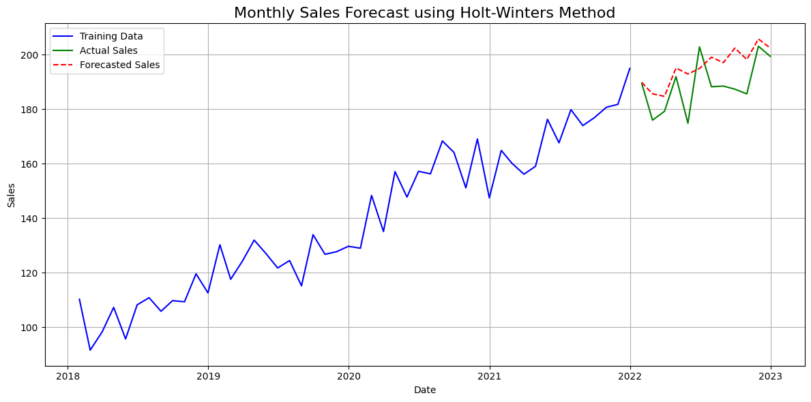

# Time Series Forecasting with Holt-Winters (Python)

This project demonstrates how to build a time series forecasting model using the Holt-Winters Exponential Smoothing technique on a synthetic monthly sales dataset. The goal is to model and predict future values using trend and seasonality.

## Overview
- Generates 5 years (60 months) of synthetic monthly sales data with trend, seasonality, and noise
- Trains a Holt-Winters (Triple Exponential Smoothing) model using `statsmodels`
- Forecasts the next 12 months of sales
- Evaluates forecast accuracy using Mean Absolute Error (MAE)
- Visualizes training data, actual values, and forecasted values on one plot

## Results
- **Mean Absolute Error (MAE):** 8.13



## Key Insight
The Holt-Winters model successfully captured both the upward trend and the seasonal monthly pattern in the data, producing a forecast that closely tracks actual sales — visible in the plot where the forecasted line (red) stays close to the actual test values (green).

## Tech Stack
Python, Pandas, NumPy, Matplotlib, Statsmodels, Scikit-learn

## How to Run
```bash
pip install -r requirements.txt
python Time_Series_forecasting.py
```

## Project Structure
Time-Series-Forecasting/
│
├── Time_Series_forecasting.py # Generates data, trains model, forecasts, plots results
├── requirements.txt
└── README.md

## Future Improvements
- Test on a real-world sales dataset instead of synthetic data
- Compare against other forecasting methods (ARIMA, SARIMA, Prophet)
- Add cross-validation across multiple forecast windows
- Deploy as an interactive Streamlit demo

